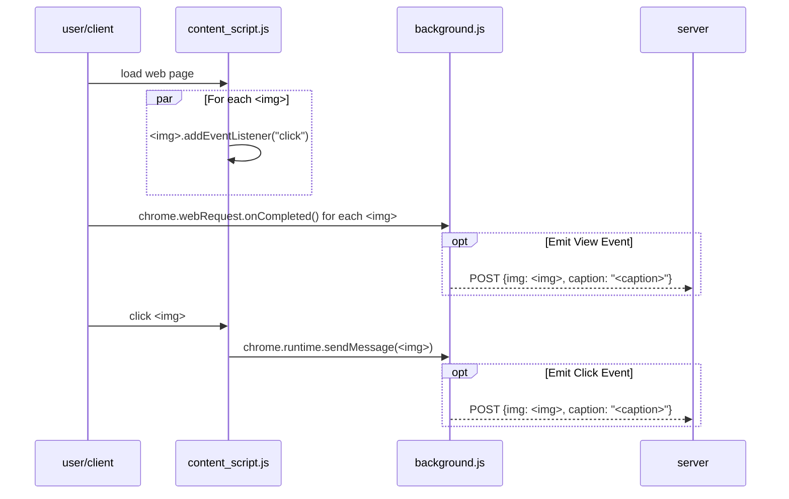

# ``nomnom``

``nomnom`` is a chrome extension that builds image label/caption datasets for machine learning from *any* images your browser renders as you browse the internet.

The goal is to enable rapid creation of image datasets from the most abundant source (other people's websites) just by clicking (or not clicking) on images in a web page: 

- quick generation of binary classification datasets (click vs no click) by using all images in a page as a "0 label" and clicked images as a "1 label"
- saving and labelling clicked images with custom, templatable captions

Your image and caption data is streamed to a server of your choice, enabling you to do funky shit like building an online data pipeline to stream images you like/dislike into a [GAN](https://en.wikipedia.org/wiki/Generative_adversarial_network), if that's the kind of thing you're into on a Saturday night.


## Goals

### What ``nomnom`` does

``nomnom`` is all about image ingestion and labelling based on user browsing behaviour on websites you chooses to monitor. You can plug it into any existing browser-based process that you'd like to get captioned training data for, without altering that process.

So if you go to website X often enough to see images and want to store/label them for fine-tuning a stable diffusion model, you might have a use case for it. These [weirdos](https://www.unstability.ai/) probably do. But also any teams that want a simple way to bootstrap a browser to collect custom caption data.

### What ``nomnom`` doesn't do

``nomnom`` isn't a tool like [Label Studio](https://labelstud.io/), which is cool but starts from having an image dataset. 

If you need an image labelling tool for an existing dataset, Label Studio is way better---but you could use ``nomom`` to collect and prelabel images to process later with tools like Label Studio, e.g. by streaming images from your browser to a server that writes them to a storage bucket. 


## Features

  - Image URL Filtering
    - ✅
    - Images can be filtered by URL using regex `match patterns <https://developer.chrome.com/docs/extensions/mv2/match_patterns>`_

  - Caption Templating
    - ✅
    - Captions can be templated using any match/replace string to simplify composing captions for stable-diffusion

  - Save all or only clicked images
    - ✅
    - Can run in 2 modes: save-all or save-clicked. To build datasets of negative examples for image classification, it's possible to save all images loaded in a page even if unclicked.

  - Remote Image Streaming
    - ✅
    - Post images & captions to a user-configurable server as you browse

  - Local Image Storage
    - ✅
    - Save images and captions to a local [IndexedDB](https://developer.mozilla.org/en-US/docs/Web/API/IndexedDB_API) in Chrome

  - Export Local Images
    - ❌
    - There's an upstream [bug](https://bugs.chromium.org/p/chromium/issues/detail?id=1368818) in chromium that prevents exporting files into a local directory.


## Installation

``nomnom`` uses the (deprecated) [Manifest version 2](https://developer.chrome.com/docs/extensions/mv2/), so to install it you must [load an unpacked extension](https://developer.chrome.com/docs/extensions/mv3/getstarted/development-basics/#load-unpacked):

1. Clone the repo

```bash
git clone https://github.com/mbhynes/nomnom
```

2. Open ``chrome://extensions/`` in your browser

3. At the top right, check *"Developer Mode"*

4. At the left, click *"Load unpacked"* and select the directory you just cloned into

### Uninstallation

1. Open ``chrome://extensions/`` in your browser

2. Choose "Remove" for the `nomnom` extension


## Using ``nomnom``

After you've installed and enabled the extension:

- Click on the extension icon in the top right to enter an image caption and your server configuration
- The images in the page you're browsing will have a **blue border** rendered around them if they are clickable
- Clicking an image **while holding the shift key** will prevent the default page action from occurring, and instead treat the click as a special "label click" to denote that the clicked image should be a positive example linked to the current caption
- To "unclick" a previously clicked image (and remove the assocation to its caption), simply hold the shift key down and clicking on the image again

## Server Configuration

A remote (or local) hostname may be provided to the extension to stream images and captions to.

The server must be configured with the following endpoints:

- ``auth-token/``

  - Purpose: authenticate a user and return an auth token
  - Accepts: ``POST``
  - Response: ``{"token": "<an_auth_token>"}``
  - Headers & Payload: 
```
    Header:
        {
          "Content-Type": "application/json",
        }
    Payload: 
        {
          "username": "<your_username>",
          "password": "<your_password>",
        }
```

- ``check-token/``
  - Purpose: check if a token is valid, returning 200 if so
  - Accepts: ``GET``
  - Response: A 200 status if the token is valid.
  - Headers: 
```
        {
          "Content-Type": "application/json",
          "Authorization": "Token <an_auth_token>"
        }
```

- ``image/``

  - Purpose: receive an image and caption data
  - Accepts: ``POST``
  - Response: 200 if the image was successfully received
  - Headers & Payload:
```
    Header:
        {
          "Content-Type": "application/json",
          "Authorization": "Token <an_auth_token>"
        }
    Payload:
        {
          "url":          "<the_url_of_the_image>",
          "initiator":    "<referring site from which the request was placed>",
          "img":          <Blob>,
          "view_events":  [
            {
              "timestamp":    "<epoch-millisecond timestamp of the event>",
              "caption":      "<string caption for the image>",
              "captionKey":   "<a local hash of the caption for local correspondence in the IndexedDB>",
              "count":        <an integer value of +1 or -1 representing the net difference in event count;
                              a negative value encodes a count adjustment since a user may "unclick"
                              an image to indicate that a previous click should be annulled.>
            },
          ]
          "click_events": [
            {
              "timestamp":    "<epoch-millisecond timestamp of the event>",
              "caption":      "<string caption for the image>",
              "captionKey":   "<a local hash of the caption for local correspondence in the IndexedDB>",
              "count":        <an integer value of +1 or -1 representing the net difference in event count;
                              a negative value encodes a count adjustment since a user may "unclick"
                              an image to indicate that a previous click should be annulled.>
            },
          ]
        }
```

## Implementation

This extension uses a combination of a [content script](https://developer.chrome.com/docs/extensions/mv2/content_scripts/) for detecting images and responding to click interactions, and a [background script](https://developer.chrome.com/docs/extensions/mv2/background_pages/) for storing the image event data in an IndexedDB and posting it to a remote server.

The heavy lifting is performed by 2 main APIs:

- (background script) [chrome.webRequest.onCompleted](https://developer.chrome.com/docs/extensions/reference/webRequest/) to attach callbacks to image download events for storing a record about each viewed image 
- (content script) [MutationObserver](https://developer.mozilla.org/en-US/docs/Web/API/MutationObserver) events to add callbacks to any `` element added to the page, sending the source URL of the `` via `chrome.runtime.sendMessage`

The high level process is illustrated in the below sequence diagram:




## Why the name ``nomnom``?

It's the sound you make as you gobble up images, *nomnomnomnom*.

## Improvements / TODOs

- Link to an example server implementation with views and routes for the token and image endpoints described above

- Add local file export to dump the IndexedDB database (images and captions) once [Chromium #1368818](https://bugs.chromium.org/p/chromium/issues/detail?id=1368818) is fixed

- Add a image dimension bandpass filter to exclude images based on user-specified maximum and minimum dimensions  

- Generalize the template variables to a dynamic input list and allow users to add & delete entries
